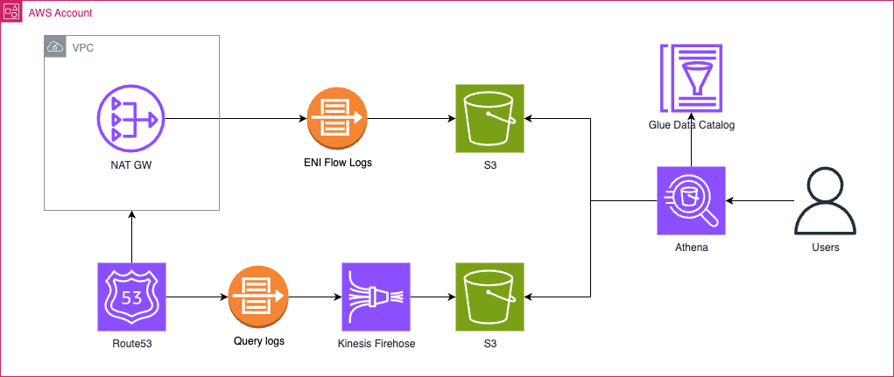
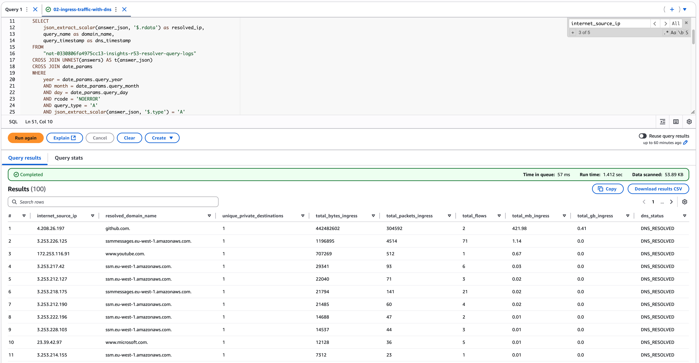

## Overview

The purpose of this module is to discover what are the external hostnames that a NAT Gateway is communicating with (both ingress and egress) and how those hosts contribute to transfer charges. Solution configures flow logs for NAT Gateway ENI, Route53 public DNS query logs for the VPC that hosts the NAT Gateway, streams the logs to S3 natively or via Kinesis Firehose (for Route53 query logs) and provides Athena tables and saved queries to analyse the data. 

### Diagram



### Query results



## Usage

1. Apply the `simple` example:
 
    ```hcl
    # ./examples/simple/main.tf

    terraform {
      required_providers {
          aws = {
              source  = "hashicorp/aws"
              version = "~> 6.0"
          }
      }
    }

    provider "aws" {
      region = var.aws_region
    }

    module "nat_gateway_insights" {
      source = "../../"
      nat_gateway_id = var.nat_gateway_id
    }
    ```
2. Go to AWS Athena -> Query Editor -> Select Workgroup related to your NAT GW -> Saved Queries 
3. Edit the query params to meet your needs

### **Available Saved Queries:**

| Saved Query Name | Purpose | Data Sources |
|------------------|---------|--------------|
| `01-egress-traffic-with-dns` | Egress analysis with DNS resolution | NAT Gateway ENI Flow Logs + Route53 Resolver Query Logs |
| `02-ingress-traffic-with-dns` | Ingress analysis with DNS resolution | NAT Gateway ENI Flow Logs + Route53 Resolver Query Logs |
| `03-egress-traffic-summary` | Analyzes outbound traffic volume from private networks to internet | NAT Gateway ENI Flow Logs |
| `04-ingress-traffic-summary` | Analyzes inbound traffic volume from internet to private networks | NAT Gateway ENI Flow Logs |
| `05-debug-route53-ip-domain-mapping` | Maps DNS queries to resolved IPv4 addresses with frequency data | Route53 Resolver Query Logs |
| `06-debug-route53-logs` | Raw Route53 query log inspection for debugging | Route53 Resolver Query Logs |

### Notes

- **WARNING:** Solution incurs costs for AWS services used to generate, store and analyse the logs: S3, Athena, Kinesis Firehose,
- Results are not meant to be 100% correct, but allow to identify biggest contributors - the solution takes the most recent domain for a given IP address that appeared on a given day,
- ENI Flow logs are partitioned hourly,
- Route53 Query logs are partitioned daily,
- Result of a query might not be stable if queried for a day that is not yet finished,
- No KMS support.

## Requirements

| Name | Version |
|------|---------|
| <a name="requirement_terraform"></a> [terraform](#requirement\_terraform) | >= 1.0 |
| <a name="requirement_aws"></a> [aws](#requirement\_aws) | ~> 6.0 |
| <a name="requirement_random"></a> [random](#requirement\_random) | ~> 3.0 |
| <a name="requirement_time"></a> [time](#requirement\_time) | ~> 0.13 |

## Providers

| Name | Version |
|------|---------|
| <a name="provider_aws"></a> [aws](#provider\_aws) | ~> 6.0 |
| <a name="provider_random"></a> [random](#provider\_random) | ~> 3.0 |
| <a name="provider_time"></a> [time](#provider\_time) | ~> 0.13 |

## Modules

| Name | Source | Version |
|------|--------|---------|
| <a name="module_s3_bucket_athena_results"></a> [s3\_bucket\_athena\_results](#module\_s3\_bucket\_athena\_results) | terraform-aws-modules/s3-bucket/aws | 5.7.0 |
| <a name="module_s3_bucket_nat_gw_eni_flow_logs"></a> [s3\_bucket\_nat\_gw\_eni\_flow\_logs](#module\_s3\_bucket\_nat\_gw\_eni\_flow\_logs) | terraform-aws-modules/s3-bucket/aws | 5.7.0 |
| <a name="module_s3_bucket_r53_resolver_query_logs"></a> [s3\_bucket\_r53\_resolver\_query\_logs](#module\_s3\_bucket\_r53\_resolver\_query\_logs) | terraform-aws-modules/s3-bucket/aws | 5.7.0 |

## Resources

| Name | Type |
|------|------|
| [aws_athena_named_query.debug_route53_ip_domain_mapping](https://registry.terraform.io/providers/hashicorp/aws/latest/docs/resources/athena_named_query) | resource |
| [aws_athena_named_query.debug_route53_logs](https://registry.terraform.io/providers/hashicorp/aws/latest/docs/resources/athena_named_query) | resource |
| [aws_athena_named_query.egress_traffic_summary](https://registry.terraform.io/providers/hashicorp/aws/latest/docs/resources/athena_named_query) | resource |
| [aws_athena_named_query.egress_traffic_with_dns](https://registry.terraform.io/providers/hashicorp/aws/latest/docs/resources/athena_named_query) | resource |
| [aws_athena_named_query.ingress_traffic_summary](https://registry.terraform.io/providers/hashicorp/aws/latest/docs/resources/athena_named_query) | resource |
| [aws_athena_named_query.ingress_traffic_with_dns](https://registry.terraform.io/providers/hashicorp/aws/latest/docs/resources/athena_named_query) | resource |
| [aws_athena_workgroup.nat_insights](https://registry.terraform.io/providers/hashicorp/aws/latest/docs/resources/athena_workgroup) | resource |
| [aws_flow_log.this](https://registry.terraform.io/providers/hashicorp/aws/latest/docs/resources/flow_log) | resource |
| [aws_glue_catalog_database.nat_analysis](https://registry.terraform.io/providers/hashicorp/aws/latest/docs/resources/glue_catalog_database) | resource |
| [aws_glue_catalog_table.nat_gw_eni_flow_logs](https://registry.terraform.io/providers/hashicorp/aws/latest/docs/resources/glue_catalog_table) | resource |
| [aws_glue_catalog_table.r53_resolver_query_logs](https://registry.terraform.io/providers/hashicorp/aws/latest/docs/resources/glue_catalog_table) | resource |
| [aws_iam_policy.firehose_policy](https://registry.terraform.io/providers/hashicorp/aws/latest/docs/resources/iam_policy) | resource |
| [aws_iam_role.firehose_role](https://registry.terraform.io/providers/hashicorp/aws/latest/docs/resources/iam_role) | resource |
| [aws_iam_role_policy_attachment.firehose_policy_attachment](https://registry.terraform.io/providers/hashicorp/aws/latest/docs/resources/iam_role_policy_attachment) | resource |
| [aws_kinesis_firehose_delivery_stream.r53_firehose](https://registry.terraform.io/providers/hashicorp/aws/latest/docs/resources/kinesis_firehose_delivery_stream) | resource |
| [aws_route53_resolver_query_log_config.this](https://registry.terraform.io/providers/hashicorp/aws/latest/docs/resources/route53_resolver_query_log_config) | resource |
| [aws_route53_resolver_query_log_config_association.this](https://registry.terraform.io/providers/hashicorp/aws/latest/docs/resources/route53_resolver_query_log_config_association) | resource |
| [random_string.this](https://registry.terraform.io/providers/hashicorp/random/latest/docs/resources/string) | resource |
| [time_static.current](https://registry.terraform.io/providers/hashicorp/time/latest/docs/resources/static) | resource |
| [aws_caller_identity.current](https://registry.terraform.io/providers/hashicorp/aws/latest/docs/data-sources/caller_identity) | data source |
| [aws_iam_policy_document.firehose_assume_role_policy](https://registry.terraform.io/providers/hashicorp/aws/latest/docs/data-sources/iam_policy_document) | data source |
| [aws_iam_policy_document.firehose_policy](https://registry.terraform.io/providers/hashicorp/aws/latest/docs/data-sources/iam_policy_document) | data source |
| [aws_iam_policy_document.s3_bucket_nat_gw_eni_flow_logs_logs_delivery_policy](https://registry.terraform.io/providers/hashicorp/aws/latest/docs/data-sources/iam_policy_document) | data source |
| [aws_nat_gateway.this](https://registry.terraform.io/providers/hashicorp/aws/latest/docs/data-sources/nat_gateway) | data source |
| [aws_partition.current](https://registry.terraform.io/providers/hashicorp/aws/latest/docs/data-sources/partition) | data source |
| [aws_region.current](https://registry.terraform.io/providers/hashicorp/aws/latest/docs/data-sources/region) | data source |
| [aws_vpc.this](https://registry.terraform.io/providers/hashicorp/aws/latest/docs/data-sources/vpc) | data source |

## Inputs

| Name | Description | Type | Default | Required |
|------|-------------|------|---------|:--------:|
| <a name="input_logs_retention_days"></a> [logs\_retention\_days](#input\_logs\_retention\_days) | Number of days to retain logs in S3 bucket before automatic deletion | `number` | `7` | no |
| <a name="input_nat_gateway_id"></a> [nat\_gateway\_id](#input\_nat\_gateway\_id) | The ID of the NAT Gateway to create insights solution for | `string` | n/a | yes |
| <a name="input_tags"></a> [tags](#input\_tags) | A mapping of tags to assign to all resources | `map(string)` | `{}` | no |

## Outputs

| Name | Description |
|------|-------------|
| <a name="output_athena_database_name"></a> [athena\_database\_name](#output\_athena\_database\_name) | Name of the Athena database for NAT Gateway insights |
| <a name="output_athena_results_bucket"></a> [athena\_results\_bucket](#output\_athena\_results\_bucket) | S3 bucket for Athena query results |
| <a name="output_athena_saved_queries"></a> [athena\_saved\_queries](#output\_athena\_saved\_queries) | AWS Athena saved queries for NAT Gateway insights with inline SQL content |
| <a name="output_athena_table_names"></a> [athena\_table\_names](#output\_athena\_table\_names) | Names of the Athena tables for NAT Gateway insights |
| <a name="output_athena_workgroup"></a> [athena\_workgroup](#output\_athena\_workgroup) | Athena workgroup for NAT Gateway insights |

